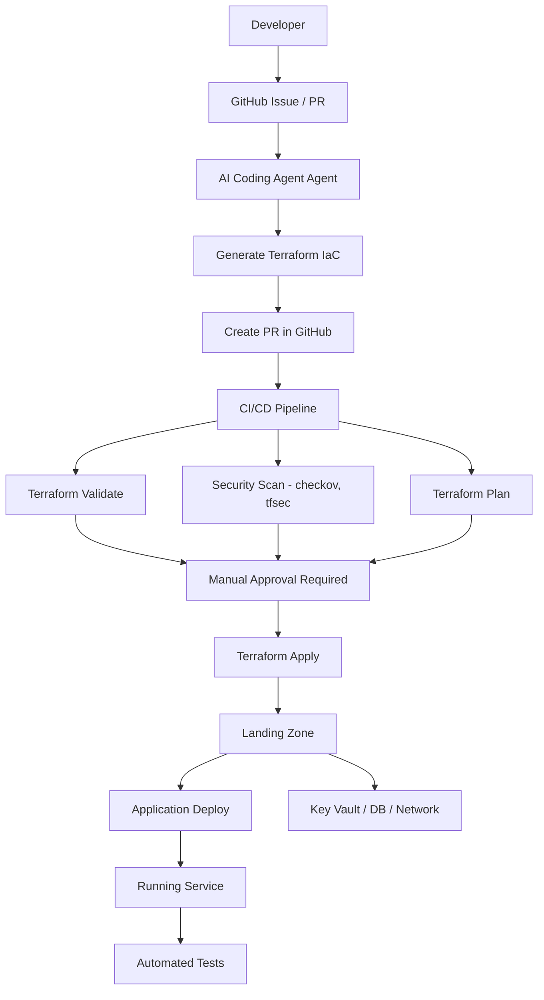
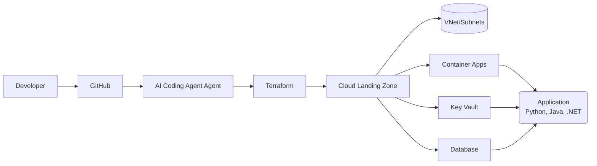
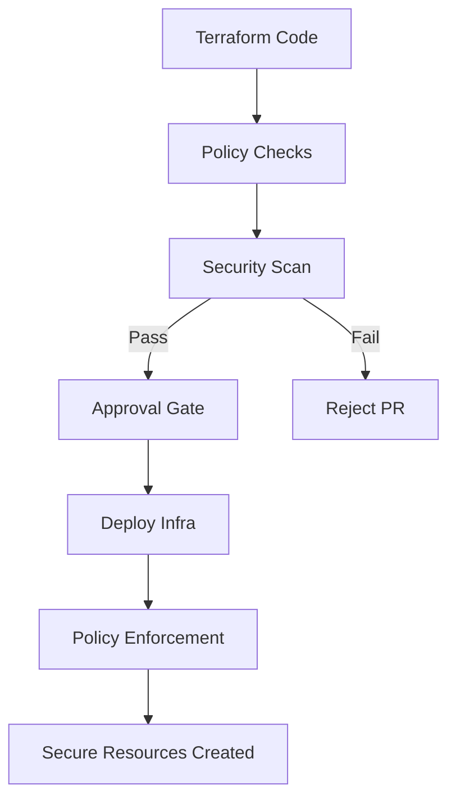

# 📦 Self-Service CI/CD Platform

## AI Coding Agent + GitHub + Terraform + AWS/Azure/GCP

---

> **What this describes:** A self-service CI/CD platform where developers request a service, an AI coding agent or a human (with AI assistance) generates the Terraform infrastructure or application code, GitHub runs validation, approval and security gates, and AWS/Azure/GCP hosts the resulting application containers — with regulatory compliance built in rather than bolted on.

---

# 🧠 Overview

This platform enables developers to **self-service infrastructure and deployments** without needing deep IaC knowledge, while enforcing **Regulatory compliance by design**.

Note this standard assumes that you will use AI coding agents such as Claude Code, Codex, AGY to build your infrastructure.

### Core Idea

* Developers **request services**
* AI Coding Agent generates Terraform
* GitHub manages workflow & approvals
* Terraform provisions infrastructure
* Azure hosts workloads
* Apps run as **Application (Python, Java, .NET) containers** on Container Apps

---

# 🏗️ Architecture Summary

## Platform Layers

### 1. Developer Interface

* GitHub Issues / PRs (initial)
* ChatOps (future: Teams / Slack)

### 2. Agent Layer

* AI Coding Agent generates IaC
* Enforces platform standards

### 3. CI/CD Layer

* Validation
* Security scanning
* Approval gates

### 4. Infrastructure Layer

* Terraform modules
* Azure/AWS/GCP landing zone

### 5. Runtime Layer

* Container Apps
* Private networking
* Managed identities

---

# 🔁 Self-Service Flow

## High-Level Steps

1. Developer requests a service
2. AI Coding Agent generates Terraform using approved modules
3. PR is created in GitHub
4. CI/CD runs validation + security checks
5. Manual approval (PCI requirement)
6. Terraform applies infrastructure
7. Application is deployed

---

# 🧱 Repository Structure

```text
platform-modules/ # Can be separated by stack
  ├── network/
  ├── container-app/
  ├── keyvault/

domain-infra/   # Infrastructure repo for each domain
  ├── modules/  # Any localized modules specific to the domain
  ├── envs/
  │    ├── dev/ #Environment specific tfvars and tf files
  │    └── prod/

service-templates/  # Organised by programming language
  ├── .github/       # GitHub workflows
  │   └── workflows/
  ├── services/         # API + worker app, data migrations & tests based on the prog language
  │   ├── api-service/
  │   └── worker-service/
  └── docs/       # Requirements, design, release documentation
      ├── specs/
      ├── adr/
      ├── archive/
      └── CHANGELOG.md
```

> The repository structure of a service is based on its **programming language**: templates live under `service-templates/`, and the generated application service repo follows the same language's conventional layout (e.g. `src/`, `tests/`, `pyproject.toml` / `pom.xml` / `.csproj`), so developers get a scaffold that matches their language's tooling and ecosystem.

**Application Service Repo Responsibilities** — each generated service repo owns:

* The service's source code, tests, and build configuration (language-native)
* A container image (Dockerfile) for the app, built and published by CI
* CI/CD pipeline definition (validation, tests, image scan, deploy)
* References to platform-managed infra (Key Vault, DB, network) — never raw Terraform
* Service manifests/health checks and deployment metadata

---

# 🔐 Regulatory compliance (Built-In)

## Key Controls

* Network segmentation (VNet, private endpoints)
* No public ingress for sensitive services
* Secrets via Secret manager only
* RBAC + Managed Identity
* Full audit trail via GitHub PRs
* Logging via Cloud Monitoring

## Enforcement

* Cloud Policies offered by provider
* Terraform scanning (Checkov / tfsec)
* Mandatory approvals in CI/CD
* Scan images (Defender / Trivy / Native Container Registry)

---

# 🤖 AI Coding Agent Responsibilities

* Generate Terraform from requests
* Enforce use of approved modules
* Prevent non-compliant configurations
* Create GitHub PRs automatically
* Assist developers (platform copilot)

---

# 🧪 Developer Experience

## Example Request

```text
New API Service:
- Name: payments-api
- Exposure: internal
- Database: postgres
```

## Outcome

* Terraform module generated
* PR created
* Infrastructure provisioned
* Application deployed

---

# 🚀 Evolution Roadmap

## Phase 1
* GitHub Issues → structured requests
* Humans write code using AI Assistance

## Phase 2

* PR-based self-service
* AI Coding Agent generates IaC/code

## Phase 3

* ChatOps (Teams / Slack)

## Phase 4

* Internal developer portal (Backstage-style)

---

# ⚠️ Key Principles

* Developers never write raw Terraform
* All infrastructure goes through approved modules
* Everything is auditable via GitHub
* Security and compliance are default

---

# 📊 Mermaid Diagrams

## 🧭 End-to-End Flow



**What it shows:** The full journey from a developer's request to a running service — the AI agent/human generates and PRs the Terraform/application code, the pipeline validates and scans it, a manual approval gate must pass (PCI requirement), then the infra is applied and the application is deployed.

---

## 🧱 Platform Architecture



**What it shows:** How the pieces fit together at runtime — developers interact with GitHub, the AI agent produces Terraform, the landing zone provisions networking, Container Apps, Key Vault and the database, and the application service (Python, Java, or .NET) consumes Key Vault for secrets and the database over private networking.

---

## 🔐 Regulatory Compliance Control Flow



**What it shows:** Compliance is enforced in the pipeline itself — every Terraform change must pass policy and security scans or the PR is rejected; only after the approval gate is infra deployed, with policy enforcement continuing to guard the resources afterwards.

---

# 🏁 Final Summary

This platform provides:

* ✅ Self-service developer experience
* ✅ Regulatory compliance by default
* ✅ Full auditability via GitHub
* ✅ Scalable platform architecture
* ✅ Extensible AI-driven automation via AI Coding Agent

---
