# 🏗️ Module 2: The Monolithic Architecture & Its Real Pain Points

## The Monolith Structure

A single codebase with all modules (Users, Orders, Payments, Inventory) tightly coupled, sharing the same database. One bug can crash everything.

```mermaid
graph TB
    subgraph Monolith["MONOLITHIC APPLICATION"]
        subgraph Code["Single Codebase"]
            Users["👤 Users Module"]
            Orders["📦 Orders Module"]
            Payments["💳 Payments Module"]
            Inventory["📊 Inventory Module"]
        end
        DB["🗄️ Shared Database"]
        Users --> DB
        Orders --> DB
        Payments --> DB
        Inventory --> DB
    end

    style Monolith fill:#ffebee,stroke:#f44336,stroke-width:3px
    style Code fill:#fff,stroke:#f44336,stroke-width:2px
    style DB fill:#ffcdd2,stroke:#f44336,stroke-width:2px
```



**Problems:**
- ❌ One bug crashes everything
- ❌ Can't scale one part without scaling all
- ❌ Slow deployments (weeks/months)
- ❌ Teams blocked by each other
- ❌ Stuck with initial tech stack

---

## The Real Problems You'll Face

### 1. **Tight Coupling** 🔗
**Scenario:** User Service changes the user ID format from integer to UUID. Orders Service breaks. Payments Service breaks. Inventory Service breaks. You have to change 4 services to deploy 1 feature.

**Impact:** Single change requires coordinating across multiple teams. Risk explodes.

### 2. **Inefficient Scaling** 📈
**Scenario:** Black Friday. Orders quadruple. The system is slow.

**Monolith reaction:** Scale everything. Deploy 4 copies instead of 1.

**Reality:**
- Users Module gets 4x capacity (but only 10% more traffic)
- Payments Module gets 4x capacity (but only 15% more traffic)
- Inventory gets 4x capacity (but only 20% more traffic)
- You wasted 3.75x capacity on systems that didn't need it

**Impact:** Cloud costs explode. 8-10x worse than necessary.

### 3. **Slow Releases** 🐢
**Timeline for deploying one small feature:**
- Develop locally: 3 days
- Code review: 2 days (waiting for 3 other teams)
- Merge conflicts: 1 day
- Full system testing: 2 days
- Staging validation: 1 day
- Security review: 2 days
- Wait for deployment window: 1 week
- **Total: 3+ weeks for a 1-day feature**

**Impact:** Competitors release 10 features while you release 1.

### 4. **Technology Lock-In** 🔒
**Scenario:** You chose Node.js in 2015. Now it's 2024. A new feature needs Python's ML libraries or Go's performance. But the entire codebase is Node.js.

**Your options:**
- Rewrite everything (2 years, $2M)
- Hack Node.js into something it wasn't designed for (technical debt)
- Stay stuck (lose market advantage)

**Impact:** Can't adopt better tools. You're trapped by history.

### 5. **Team Scaling Pain** 👥
**New developer onboarding:**
- Week 1-2: Understanding the entire codebase
- Week 3: Understanding how to make a safe change
- Week 4+: Actually productive

**Impact:** Each new hire takes 4 weeks. Teams grow slowly. Productivity gains are minimal.

### 6. **Deployment Risk** 💥
**One typo:**
```javascript
// User Service logic (accidentally deployed)
if (user.isActive === false) {  // Bug: should be true
  deleteUserAccount();  // Deletes ALL active users
}
```

**Blast radius:** ENTIRE SYSTEM DOWN. All services affected. All users impacted.

**Recovery:** Rollback the entire application. 30 minutes of downtime. Lost revenue. Customer trust damaged.
