[← Back to Index](./INDEX.md)

# 🚀 Module 3: Introducing Cloud-Native Microservices

## The Core Insight

Instead of one big monolithic application, build many small, independent services. Each service:
- Owns its own business logic and data
- Runs in its own container
- Can be deployed independently
- Communicates via APIs or events
- Can scale independently based on actual load

---

## Microservices Architecture Overview

```mermaid
graph TB
    Client["🖥️ Client Applications"]
    Gateway["🚪 API Gateway<br/>Entry Point"]

    Client --> Gateway

    Gateway --> Users["👤 Users Service"]
    Gateway --> Orders["📦 Orders Service"]
    Gateway --> Payments["💳 Payments Service"]
    Gateway --> Inventory["📊 Inventory Service"]

    Users --> UserDB["🗄️ Users DB"]
    Orders --> OrderDB["🗄️ Orders DB"]
    Payments --> PaymentDB["🗄️ Payments DB"]
    Inventory --> InventoryDB["🗄️ Inventory DB"]

    Users -.->|Events| Broker["📨 Message Broker"]
    Orders -.->|Events| Broker
    Payments -.->|Events| Broker
    Inventory -.->|Events| Broker

    style Gateway fill:#667eea,stroke:#667eea,color:#fff
    style Users fill:#4caf50,stroke:#4caf50,color:#fff
    style Orders fill:#4caf50,stroke:#4caf50,color:#fff
    style Payments fill:#4caf50,stroke:#4caf50,color:#fff
    style Inventory fill:#4caf50,stroke:#4caf50,color:#fff
    style Broker fill:#ff9800,stroke:#ff9800,color:#fff
```



Each service:
- Routes requests to appropriate services
- Handles cross-cutting concerns
- Provides unified interface to clients

---

## Key Principle #1: Single Responsibility

Each microservice handles **one** business capability, and only one.

| Service | Responsibility | Does NOT Do |
|---------|-----------------|-------------|
| **Orders** | Create orders, manage order lifecycle, tracking | Payments, inventory management, user auth |
| **Payments** | Authorize cards, charge customers, refunds | Order management, shipping, user profiles |
| **Users** | User accounts, authentication, profiles | Orders, payments, inventory |
| **Inventory** | Stock levels, reservations, shipping | Payments, orders, users |

**Why?** When responsibility is clear, changes are localized. User Service can change without affecting Orders.

---

## Key Principle #2: Independent Deployment

Deploy **one** service without touching the others.

```
Before (Monolith):
Team A (Users)   ──┐
Team B (Orders)  ├──► Merge ──► Test ──► Deploy ALL or NOTHING
Team C (Payments)──┘
Deploy success? Great, all 3 changes go live.
Deploy failure? All changes roll back, blocking all 3 teams.

After (Microservices):
Team A deploys Users Service           ✓ Success
Team B deploys Orders Service          ✓ Success
Team C deploys Payments Service        ✗ Fails—ONLY Payments rolled back
                                         Users and Orders still live
                                         Team C can fix and redeploy in 10 min
```

**Benefit:** Each team ships independently. One failure doesn't block others.

---

## Key Principle #3: Technology Autonomy

Use the **right tool** for each service.

```
Orders Service (high throughput, low latency)  → Go
User Service (rapid development, data science) → Python
Payments Service (strict correctness)           → Rust
Real-time notifications                        → Node.js
Batch processing                               → Java (Spring Batch)

All communicate via REST APIs or events. No coupling.
```

**Benefit:** Not locked into 2010's technology decisions.

---

## Key Principle #4: Scalability - Scale What Matters

Scale **only** the services that need it.

```
NORMAL DAY:
┌────────┐
│ Users  │ 1 instance (500 requests/sec)
├────────┤
│ Orders │ 1 instance (200 requests/sec)  ← Bottleneck isn't here
├────────┤
│ Paymnts│ 1 instance (150 requests/sec)
├────────┤
│ Invntry│ 1 instance (300 requests/sec)
└────────┘

BLACK FRIDAY (10x traffic):
┌────────────────────┐
│ Users  │ 3 instances (traffic spike on login)
├────────────────────┤
│ Orders │ 10 instances ← ONLY scale the real bottleneck
├────────────────────┤
│ Paymnts│ 5 instances
├────────────────────┤
│ Invntry│ 2 instances
└────────────────────┘

Cost Impact:
Monolith:  Scale all 4 by 10x = 40 instances = 4x cloud bill
Microservices: Add only 15 instances = 1.4x cloud bill
Savings: 65% lower infrastructure costs
```

---

## Key Principle #5: Fault Isolation

One service crashes. Others keep working.

```
MONOLITH:
Notification Service bug → Entire system down
Impact: Users can't log in, orders fail, payments fail
Recovery time: 30 minutes

MICROSERVICES:
Notification Service bug → Notification Service down
Impact: Users can log in ✓, place orders ✓, pay ✓, they just don't get notifications
Recovery time: 5 minutes
Fallback: Send notifications via email instead
```

**Benefit:** Failures are contained. System gracefully degrades.

---

[← Back to Index](./INDEX.md) | [Previous: Module 2](./02-Monolith-Pain.md) | [Next: Module 4 →](./04-DDD-Concepts.md)
