[← Back to Index](./INDEX.md)

# 🎯 Module 4: Domain-Driven Design - The Missing Piece

## The Problem DDD Solves

If microservices are just "split the monolith randomly," you create new problems:

```
❌ Poor Boundaries:
   Orders Service talks to Payments Service talks to Inventory Service
   in a complex chain of dependencies.

❌ Shared Databases:
   Everyone reads/writes UserTable, OrderTable, PaymentTable
   (This is just the monolith database structure!)

❌ Services That Change Together:
   Users and Payments are tightly coupled
   Can't deploy one without the other
   Defeats the purpose of microservices
```

---

## What is Domain-Driven Design (DDD)?

DDD is a set of techniques for understanding your **business** deeply, then using that understanding to design services with clear boundaries.

---

## Key Concept #1: Bounded Context

A clear boundary around a cohesive set of business logic where a specific vocabulary applies.

```mermaid
graph TB
    subgraph OrdersContext["📦 ORDERS BOUNDED CONTEXT"]
        OE["<b>Entities</b><br/>Order, LineItem"]
        OV["<b>Value Objects</b><br/>OrderStatus, ShippingAddress"]
        OR["<b>Rules</b><br/>Can't cancel fulfilled<br/>Max 1000 items<br/>Need payment first"]
        ODB["🗄️ Orders DB"]
    end

    subgraph PaymentsContext["💳 PAYMENTS BOUNDED CONTEXT"]
        PE["<b>Entities</b><br/>Transaction, PaymentMethod"]
        PV["<b>Value Objects</b><br/>Money, TransactionStatus"]
        PR["<b>Rules</b><br/>Max $100k per tx<br/>Refund within 90d"]
        PDB["🗄️ Payments DB"]
    end

    API["🔗 API Contract<br/>REST/Events"]

    OrdersContext --> API
    API --> PaymentsContext

    style OrdersContext fill:#e8f5e9,stroke:#4caf50,stroke-width:2px
    style PaymentsContext fill:#e3f2fd,stroke:#2196f3,stroke-width:2px
    style API fill:#fff9c4,stroke:#fbc02d,stroke-width:2px
```



**Key insight:** Each bounded context has:
- Its own vocabulary (ubiquitous language)
- Its own data model
- Its own rules
- Clear API contracts with other contexts

---

## Key Concept #2: Ubiquitous Language

Shared vocabulary that appears everywhere: code, documentation, conversations.

```
In the Orders context:
- We say "Submit Order" not "Create OrderRecord"
- We say "Fulfill Order" not "Update Status = 'shipped'"
- We say "Cancel Order" not "Set Active = false"

In the Payments context:
- We say "Authorize Payment" not "CheckCard"
- We say "Capture Payment" not "ChargeCard"
- We say "Issue Refund" not "ReverseTransaction"

This language appears in:
✓ Code: submitOrder(), fulfillOrder(), cancelOrder()
✓ API contracts: POST /orders/123/submit
✓ Documentation: "Submit Order initiates fulfillment"
✓ Conversations: "We need to submit the order"
```

**Why?** Reduces misunderstandings. Everyone speaks the same language.

---

## Key Concept #3: Entities vs. Value Objects

**Entity:** Has a unique identity and lifecycle.
```
Order #12345
- Has an identity (12345)
- Has a lifecycle (pending → paid → fulfilled → completed)
- Changes over time (status changes, items added/removed)
- We track its history and state
```

**Value Object:** No identity, just values. Immutable.
```
ShippingAddress
- 123 Main St, San Francisco, CA 94102
- No identity (doesn't matter which address instance)
- Immutable (doesn't change, creates new one if different)
- Defined by its values
```

---

## Key Concept #4: Aggregates

A cluster of entities and value objects treated as **one unit**. The aggregate root is the entry point.


**Key interactions:**
```
order.addLineItem(product, quantity)
order.shipTo(address)
order.getTotal()
```

This keeps the aggregate consistent. You don't access LineItem directly.

**Why aggregates?** Simplifies data management. Order knows how to update itself correctly. Prevents inconsistent states.

---

## Key Concept #5: Repositories

Hide the complexity of data access. Your code doesn't know where data lives.

```
Before (Tight Coupling):
  const order = db.query("SELECT * FROM orders WHERE id = 123");
  order.status = "fulfilled";
  db.update("UPDATE orders SET status = 'fulfilled' WHERE id = 123");

After (With Repository):
  const order = orderRepository.getById(123);
  order.fulfill();
  orderRepository.save(order);

Benefits:
- Implementation detail: Could be SQL, NoSQL, REST API—code doesn't care
- Testing: Easy to mock the repository
- Changes: Swap database without changing business logic
```

---

## The DDD Design Process

1. **Talk to domain experts:** What are the core business processes?
2. **Identify bounded contexts:** Where does terminology change? Where do responsibilities split?
3. **Model the aggregate:** What entities and value objects form a cohesive unit?
4. **Design repositories:** How do we persist and retrieve aggregates?
5. **Define API contracts:** How do bounded contexts communicate?
6. **Implement in services:** Each bounded context becomes a microservice

---

[← Back to Index](./INDEX.md) | [Previous: Module 3](./03-Microservices.md) | [Next: Module 5 →](./05-Problem-Solution.md)
