[← Back to Index](./INDEX.md)

# 🔄 Module 5: Problem-Solution Patterns

## Problem #1: Multiple Teams, One Codebase

### THE PAIN (Monolith):


**Issues:**
- 47 merge conflicts
- 3-week code review queue
- Teams block each other
- Monthly deploy window
- One bug = entire month delayed

### THE SOLUTION (Microservices):


**Benefits:**
- Each team owns their repo
- Tests in 5 minutes
- Deploy independently in 10 minutes
- Multiple times per day
- One service bug? Only that service rolls back
- Changes isolated, testing fast and targeted

---

## Problem #2: Scaling Bottlenecks

### THE PAIN (Monolith):



```mermaid
graph LR
    subgraph Normal["Normal Day"]
        NU["Users 500 req/s"]
        NO["Orders 200 req/s"]
        NP["Payments 150 req/s"]
        NI["Inventory 300 req/s"]
    end

    subgraph Monolith["Monolith Scaling 10x"]
        MU["Users ×10<br/>Wasted"]
        MO["Orders ×10<br/>25% used"]
        MP["Payments ×10<br/>15% used"]
        MI["Inventory ×10<br/>20% used"]
    end

    Normal -->|Scale All| Monolith

    style Monolith fill:#ffebee,stroke:#f44336
```

**Wasted Capacity:**
- 75% unused (7.5 of 10 instances)
- $500/month actual cost
- $150-200/month optimal cost
- **$300-350/month wasted**

### THE SOLUTION (Microservices):



```mermaid
graph LR
    subgraph Normal["Normal Day"]
        NU["Users 500 req/s"]
        NO["Orders 200 req/s"]
        NP["Payments 150 req/s"]
        NI["Inventory 300 req/s"]
    end

    subgraph Micro["Microservices Smart Scaling"]
        MiU["Users ×5<br/>Fully used"]
        MiO["Orders ×10<br/>Fully used"]
        MiP["Payments ×3<br/>Fully used"]
        MiI["Inventory ×2<br/>Fully used"]
    end

    Normal -->|Scale Smart| Micro

    style Micro fill:#e8f5e9,stroke:#4caf50
```

**Cost Breakdown:**
- Users: 5 × $50 = $250
- Orders: 3 × $50 = $150
- Payments: 2 × $50 = $100
- Inventory: 2 × $50 = $100
- **Total: $600/month**

**Comparison:**
- Monolith: $500 (wasting $300)
- Microservices: $600 (wasting only $90)
- **Result:** Better performance at similar cost!

---

## Problem #3: Technology Evolution

### THE PAIN (Monolith):

```
2015: You choose Node.js for the team
      → Entire codebase is JavaScript

2016: You hire a Python expert
      → They have to write JavaScript (expertise wasted)

2018: Someone discovers Rust is 100x faster for your use case
      → Can't rewrite. Too entrenched.

2020: Go becomes popular for microservices
      → Can't use it. Stuck with Node.js

2024: Your system is slow and outdated
      → Competitors using Rust, Go, modern frameworks
      → You're 5 years behind technologically
      → Lost product differentiation
```

### THE SOLUTION (Microservices):

```
2015: Core Services: Node.js
      → Users, Orders, Payments established

2016: Hire Python expert
      → Build new Analytics Service in Python

2018: Discover Rust need
      → Build new RealTimeNotifications Service in Rust
      → Runs alongside Node.js services

2020: Go becomes useful
      → New DataProcessing Service in Go

2024: Your system is modern and optimized
      → Each service uses the right technology
      → Can migrate legacy services gradually
      → New features use best-in-class tools

Tech Stack:
  Users Service: Node.js (still works fine)
  Orders Service: Node.js (still works fine)
  Payments Service: Rust (migrated for speed)
  Analytics Service: Python (machine learning)
  Real-time: Elixir (distributed computing)
  Data Pipeline: Go (performance)

Benefits:
  ✓ Expert developers can use their strengths
  ✓ Technology follows problem requirements
  ✓ Can adopt new tools without rewrites
  ✓ Competitive advantage through better technology
```

---

## Problem #4: Feature Development Speed

### THE PAIN (Monolith):

```mermaid
timeline
    title Monolith Feature Timeline
    section Week 1
        Mon 9am: Start development
        Thu 5pm: Code complete
        Fri 10am: Create PR
    section Week 2
        Tue 2pm: Code review 47 comments
        Wed 11am: Second review approved
        Wed 2pm: Merge to main
        Wed 2pm: Full test suite fails
    section Week 3
        Wed 3:30pm: Fix flaky test
        Thu 11am: Finally merged
        Thu 2pm: Deploy to staging
        Thu 2pm: Full system test 2 hours
    section Week 4
        Fri 10am: Security review
        Fri 4pm: Approved for production
    section Month Later
        Apr 1: Deploy to production
```

**Total Time: 3+ weeks for a 3-day feature**

### THE SOLUTION (Microservices + DDD):

```mermaid
timeline
    title Microservices Feature Timeline
    section Week 1
        Mon 9am: Start development
        Thu 4pm: Code complete
        Fri 9am: Create PR
        Fri 10am: Merged
        Fri 11am: Users Service tests 5 min
        Fri 11:10am: Security review 20 min
        Fri 11:30am: Deploy to production ✓
```

**Total Time: 2.5 days for a 3-day feature**

| Aspect | Monolith | Microservices |
|--------|----------|---------------|
| Code review | 3+ days | 1 hour |
| Testing | 45 minutes | 5 minutes |
| Deployment | Monthly window | Immediate |
| Security review | Multiple days | 20 minutes |
| Risk | High (entire system) | Low (1 service) |

**RESULT: Ship 8-10x faster with lower risk!**

---

[← Back to Index](./INDEX.md) | [Previous: Module 4](./04-DDD-Concepts.md) | [Next: Module 6 →](./06-Principles.md)
