[← Back to Index](./INDEX.md)

# 🤖 Module 8: AI-Native Development

## The Paradigm Shift

AI-Native development means designing systems to leverage AI from day one—not bolting it on later. It's about recognizing that AI-powered features are now core business capabilities, not optional enhancements. Modern microservices must include AI services, inference endpoints, feature stores, and continuous learning loops as first-class citizens.

---

## Plan-Build-Test-Deploy-Monitor Workflow


---

## 📋 Phase 1: Plan

### What Happens in Planning

**Goals:**
- Identify business problems AI can solve
- Define success metrics (accuracy, latency, cost)
- Determine data requirements and sources
- Estimate resource needs (compute, storage, budget)

**Example Use Cases:**
- **Recommendation Engine:** Predict products users want to buy
- **Fraud Detection:** Identify suspicious transactions in real-time
- **Search Ranking:** ML-powered search results instead of keyword matching
- **Pricing Optimization:** Dynamic pricing based on demand and inventory
- **Customer Support:** AI chatbot for common questions, escalate complex issues

**Key Planning Questions:**
- What's the business impact if the model is 90% accurate vs 99% accurate?
- How much latency can we tolerate? (10ms? 100ms? 1 second?)
- What's the cost per prediction? Can we afford it at scale?
- What happens if the model makes a bad prediction? How do we recover?

---

## 🔨 Phase 2: Build

### Model Development & Training

**Key Components:**
- **Data Pipeline:** Extract, transform, load data from sources
- **Feature Engineering:** Create meaningful features from raw data
- **Model Training:** Train on historical data
- **Feature Store:** Centralized repo of features for all models
- **Model Serving:** API endpoints to get predictions

**Architecture:**

```mermaid
graph LR
    Raw["📊 Raw Data<br/>Databases<br/>APIs<br/>Logs"]
    Pipeline["⚙️ Data Pipeline<br/>ETL<br/>Cleaning<br/>Transform"]
    FS["🗄️ Feature Store<br/>Centralized<br/>Features"]
    Training["🤖 Model Training<br/>Supervised<br/>Feature Selection<br/>Tuning"]
    Model["🧠 Trained Model<br/>Weights &<br/>Parameters"]
    Serving["🔌 Model Serving<br/>REST API<br/>gRPC<br/>Batch"]
    Apps["📱 Applications<br/>Recommendations<br/>Search<br/>Pricing"]

    Raw --> Pipeline
    Pipeline --> FS
    FS --> Training
    Training --> Model
    Model --> Serving
    Serving --> Apps

    style Raw fill:#ffebee,stroke:#f44336
    style Pipeline fill:#fff3e0,stroke:#ff9800
    style FS fill:#e3f2fd,stroke:#2196f3
    style Training fill:#f3e5f5,stroke:#9c27b0
    style Model fill:#667eea,stroke:#667eea,color:#fff
    style Serving fill:#4caf50,stroke:#4caf50,color:#fff
    style Apps fill:#00bcd4,stroke:#00bcd4,color:#fff
```



**Feature Store Benefits:**
- Reuse features across models (avoid duplication)
- Consistent features in training and serving
- Real-time feature updates
- Easy rollback if features are incorrect

---

## ✅ Phase 3: Test

### Validation & Quality Assurance

**Types of Tests:**

| Test Type | What It Checks | Example |
|-----------|----------------|---------|
| **Accuracy Tests** | Model makes correct predictions | Precision, Recall, F1-Score > threshold |
| **Edge Case Tests** | Handles unusual inputs | New user, missing data, extreme values |
| **Latency Tests** | Fast enough for production | Prediction < 50ms, batch < 5 minutes |
| **Bias Tests** | Fair across demographics | Accuracy equal for all user groups |
| **Integration Tests** | Works with rest of system | API returns correct format |
| **Drift Detection** | Data hasn't changed dramatically | Data distribution similar to training |

**Testing Pyramid:**
```
        End-to-End Tests (1-2 tests)
          Integration Tests (10-20 tests)
      Unit Tests (100+ tests)
```

---

## 🚀 Phase 4: Deploy

### Production Release Strategies

**Canary Deployment:**
Route 5% of traffic to new model. If metrics look good after 1 hour, route 25%. After 4 hours, route 100%.
- **Benefit:** Catch bugs affecting real users before rolling out to everyone.

**A/B Testing:**
Show new model to 50% of users, old model to other 50%. Compare results after 1 week.
- **Benefit:** Measure business impact (revenue, engagement, user satisfaction).

**Shadow Mode:**
Run new model alongside old model. Don't show results to users. Compare predictions.
- **Benefit:** Validate model in production without risk.

**Blue-Green Deployment:**
Keep old model running (blue). Deploy new model (green). If new model has issues, switch back to blue instantly.
- **Benefit:** Zero downtime, instant rollback.

---

## 📊 Continuous Learning & Monitoring

### How Models Stay Accurate

**The Problem: Model Drift**
Your model was trained on 2024 data. It's now 2025. User behavior changed. Your competitors changed. The model was 95% accurate, now it's 87% accurate.

**The Solution: Continuous Learning Loop**

```mermaid
graph TB
    Model["🧠 Model in Production<br/>Makes predictions"]
    Monitor["👀 Monitor Performance<br/>Accuracy, Latency, Drift"]
    Data["📊 Collect New Data<br/>User feedback<br/>Business outcomes"]
    Trigger{"🚨 Drift<br/>Detected?"}
    Retrain["🔄 Retrain Model<br/>With new data"]
    Test["✅ Test New Model<br/>Validate accuracy"]
    Deploy["🚀 Deploy New Model<br/>Replace old model"]

    Model --> Monitor
    Monitor --> Data
    Data --> Trigger
    Trigger -->|Yes| Retrain
    Trigger -->|No| Model
    Retrain --> Test
    Test --> Deploy
    Deploy --> Model

    style Model fill:#4caf50,stroke:#4caf50,color:#fff
    style Monitor fill:#2196f3,stroke:#2196f3,color:#fff
    style Data fill:#ff9800,stroke:#ff9800,color:#fff
    style Trigger fill:#f44336,stroke:#f44336,color:#fff
    style Retrain fill:#9c27b0,stroke:#9c27b0,color:#fff
    style Test fill:#00bcd4,stroke:#00bcd4,color:#fff
    style Deploy fill:#4caf50,stroke:#4caf50,color:#fff
```



**Key Metrics to Monitor:**
- **Model Accuracy:** Still making correct predictions?
- **Latency:** Serving predictions fast enough?
- **Data Drift:** Input data distribution changing?
- **Prediction Drift:** Output distribution changing?
- **Business Metrics:** Revenue, engagement, user satisfaction impact?
- **Feedback:** User feedback indicating issues?

---

## AI-Native in Microservices Architecture


---

## AI-Native Development Best Practices

1. **Design for Inference**
   - Optimize for serving predictions, not just training
   - Low latency, high throughput

2. **Instrument Everything**
   - Log predictions, features, accuracy metrics
   - Detect drift early

3. **Build Feedback Loops**
   - Collect user feedback
   - Correct predictions
   - Retrain automatically

4. **Monitor for Bias**
   - Ensure fairness across user groups
   - Measure accuracy per demographic

5. **Test Edge Cases**
   - New users, missing data, extreme values
   - Models must handle gracefully

6. **Start with Simple Models**
   - Linear regression beats complex model with mediocre data
   - Simple is interpretable

7. **Version Everything**
   - Data versions, model versions, feature versions
   - Need to rollback? Easy.

8. **MLOps as First-Class**
   - Model serving, monitoring, retraining pipelines
   - As important as the model itself

---

## Real-World Example: Recommendation Engine

### From Plan to Deploy

**📋 Plan Phase:**
- Goal: Recommend products users will click on
- Success metric: 20% increase in click-through rate
- Data needed: User browsing history, product features, user demographics
- Infrastructure: Feature store, real-time serving, monitoring

**🔨 Build Phase:**
- Extract features: "user_viewed_products", "product_category_preference", "seasonal_trends"
- Train collaborative filtering model on historical user-product interactions
- Create model serving endpoint: POST /recommendations with user_id, returns [product_id, confidence_score]
- Set up feature store for real-time feature updates

**✅ Test Phase:**
- Accuracy: Test on hold-out 20% of data. Need 80%+ accuracy
- Latency: P99 latency < 100ms
- Bias: Check accuracy is equal across demographics
- Integration: API returns correct format, integrates with search results

**🚀 Deploy Phase:**
- Day 1: Canary to 5% of users, monitor metrics hourly
- Day 2: If metrics good, increase to 25% of users
- Day 3: 100% of users receiving recommendations
- Week 1-2: A/B test. Track CTR, purchase rate, user engagement

**📊 Monitoring Phase:**
- Accuracy drops from 80% to 72%? Retrain with fresh data
- Latency increasing? Scale the service, optimize the model
- User feedback: "Recommendations are too generic"? Adjust model
- Seasonal trends change (e.g., summer vs winter products)? Retrain weekly

---

## Integration with Your Microservices

**How AI Services Fit In:**
- Each AI capability becomes a service (Recommendations, Search Ranking, Fraud Detection)
- Services have their own models, feature stores, monitoring
- Services communicate via APIs (REST, gRPC)
- Centralized monitoring watches for model drift across all services
- Retraining can happen independently per service
- Failed model deployments only affect one service, not the entire system

---

## Key Takeaways

| Phase | Key Question | Success Criteria |
|-------|--------------|------------------|
| **Plan** | What problem are we solving? | Clear metrics, stakeholder buy-in |
| **Build** | Can we train a good model? | Model accuracy > threshold, fast inference |
| **Test** | Does it work in the real world? | Handles edge cases, fair across users, latency acceptable |
| **Deploy** | Is it safe to release? | Canary metrics look good, business metrics positive |
| **Monitor** | Is it staying accurate? | Drift detected early, auto-retraining triggered, no silent failures |

---

## Next Steps for Your Team

1. **Identify ML Opportunities**
   - What decisions are humans making 1000+ times per day?
   - What would 5% accuracy improvement be worth?
   - What data do you already have?

2. **Design AI Service Architecture**
   - How does the ML service fit into your microservices?
   - What's the feature store strategy?
   - How do you monitor for model drift?

3. **Start with a Pilot**
   - Pick one low-risk ML use case (e.g., recommendations, not fraud)
   - Follow Plan → Build → Test → Deploy → Monitor
   - Learn from real-world feedback

4. **Scale Across Organization**
   - Build reusable feature store
   - Standardize model serving approach
   - Create MLOps team to support all services

---

[← Back to Index](./INDEX.md) | [Previous: Module 7](./07-Roadmap.md) | [Start Over ↑](./INDEX.md)
